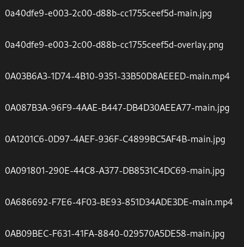

# SnapchatMemoriesMetadataAdder

Adds metadata (captions and timestamps) to your exported Snapchat memories.

## Background
Snapchat allows you to save images/videos to their servers with their memories
feature. When you export your memories from Snapchat [from their accounts
website](https://accounts.snapchat.com), you get all the memories, but with no
metadata and the captions are stored separately!



You may then go to an alternate project like [ToTheMax's Snapchat-All-Memories-
Downloader](https://github.com/ToTheMax/Snapchat-All-Memories-Downloader), which
is fantastic and will download all memories and add the timestamp, but now there
are no captions on the images at all!

This project serves as a bridge between these two methods! We have all the
metadata and we have all the memory photos/videos and captions, we just need to
combine them.

## Install

This project requires [Python](https://www.python.org/) to be installed on your
computer. Once installed, you can clone this repo and run

```shell
python -m pip install -r requirements.txt
```

to install the requirements for the project.

TBD - ffmpeg and vips?

## Usage

First, we need to get our data.

- [Follow Snapchat's instructions to download your
  data](https://help.snapchat.com/hc/en-gb/articles/7012305371156), making sure
  to "Include your memories as a downloadable file" and put no date range to get
  all memories! Wait for an email and download when ready. If you get multiple
  zip files, merge all the `memories` folders into one `memories` folder. This
  is the only folder you need.
- Next, request your data again, but *do not* include your memories. This
  should be much quicker :) In this data export, make sure you have a `json/
  memories_history.json`. This is the metadata for the memories.

Now, make a folder in this repo called `input` and put the `memories` folder
from the first export and the `memories_history.json` file from the second
export into it.

With this folder prepared, you can now run `TBD` to run the script! It will
create a new folder called `output` that will hold all memories with timestamps
and captions.

## Contributing

There's more metadata in the `memories_history.json` file that isn't being added
to the files (namely location), I'm more than open to accepting contributions to
add those.

## License
MIT